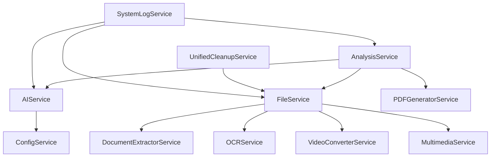

# 🔧 Services Backend - DocuSense AI

## 📋 Vue d'ensemble

Ce document décrit tous les services backend de DocuSense AI, leur rôle, leurs fonctionnalités et leur utilisation.

## 🏗️ Architecture des Services

### **Pattern de Base**
Tous les services héritent de `BaseService` et suivent le pattern de service unifié :
- Gestion d'erreurs centralisée
- Logging structuré
- Configuration via dépendance injection
- Méthodes CRUD standardisées

## 🔧 Services Principaux

### **1. AnalysisService** (29KB - 705 lignes)
**Fichier :** `backend/app/services/analysis_service.py`

#### 🎯 **Rôle**
Service principal pour la gestion des analyses de documents avec IA.

#### 📋 **Fonctionnalités**
- Création et gestion d'analyses
- Intégration avec les providers IA
- Gestion de la queue d'analyses
- Génération de rapports PDF
- Historique des analyses

#### 🔗 **Endpoints Associés**
- `POST /api/analysis/create` - Créer une analyse
- `GET /api/analysis/{id}` - Récupérer une analyse
- `GET /api/analysis/list` - Lister les analyses
- `DELETE /api/analysis/{id}` - Supprimer une analyse

#### 💻 **Utilisation**
```python
from app.services.analysis_service import AnalysisService

# Créer une analyse
analysis = await analysis_service.create_analysis(
    file_id=file_id,
    user_id=user_id,
    prompt_type="universal"
)

# Récupérer une analyse
analysis = await analysis_service.get_analysis(analysis_id)
```

### **2. AIService** (41KB - 945 lignes)
**Fichier :** `backend/app/services/ai_service.py`

#### 🎯 **Rôle**
Service de gestion des providers IA et de traitement des requêtes IA.

#### 📋 **Fonctionnalités**
- Support multi-providers (OpenAI, Claude, Mistral, Gemini, Ollama)
- Sélection automatique de provider
- Gestion des prompts universels
- Fallback en cas d'échec
- Optimisation des coûts

#### 🔗 **Providers Supportés**
- **OpenAI** : GPT-4, GPT-3.5-turbo
- **Anthropic** : Claude-3, Claude-2
- **Mistral** : Mistral-7B, Mixtral-8x7B
- **Google** : Gemini Pro
- **Ollama** : Modèles locaux

#### 💻 **Utilisation**
```python
from app.services.ai_service import AIService

# Analyser un document
response = await ai_service.analyze_document(
    content=document_content,
    prompt_type="universal",
    provider="auto"
)

# Tester un provider
status = await ai_service.test_provider("openai")
```

### **3. FileService** (38KB - 874 lignes)
**Fichier :** `backend/app/services/file_service.py`

#### 🎯 **Rôle**
Service de gestion des fichiers et de leur traitement.

#### 📋 **Fonctionnalités**
- Upload et validation de fichiers
- Support multi-formats (43 formats images, 39 formats vidéo, 37 formats audio)
- Extraction de contenu textuel
- Gestion des métadonnées
- Nettoyage automatique

#### 🔗 **Formats Supportés**
- **Documents** : PDF, DOCX, PPTX, XLSX, TXT, RTF, MD, CSV
- **Images** : JPG, PNG, GIF, WebP, HEIC, SVG, TIFF, BMP, ICO, RAW
- **Vidéos** : MP4, AVI, MOV, WMV, FLV, WebM, MKV
- **Audio** : MP3, WAV, FLAC, AAC, OGG, WMA

#### 💻 **Utilisation**
```python
from app.services.file_service import FileService

# Uploader un fichier
file_info = await file_service.upload_file(
    file=uploaded_file,
    user_id=user_id
)

# Extraire le contenu
content = await file_service.extract_content(file_id)
```

### **4. ConfigService** (79KB - 1770 lignes)
**Fichier :** `backend/app/services/config_service.py`

#### 🎯 **Rôle**
Service de gestion de la configuration système et des paramètres utilisateur.

#### 📋 **Fonctionnalités**
- Configuration des providers IA
- Gestion des clés API
- Paramètres système
- Configuration utilisateur
- Tests de connectivité

#### 🔗 **Endpoints Associés**
- `GET /api/config/providers` - Récupérer les providers
- `POST /api/config/save` - Sauvegarder la configuration
- `POST /api/config/test` - Tester un provider
- `GET /api/config/system` - Configuration système

#### 💻 **Utilisation**
```python
from app.services.config_service import ConfigService

# Sauvegarder la configuration
await config_service.save_config(
    provider="openai",
    api_key="sk-...",
    user_id=user_id
)

# Tester un provider
status = await config_service.test_provider("openai")
```

### **5. UnifiedCleanupService** (20KB - 524 lignes)
**Fichier :** `backend/app/services/unified_cleanup_service.py`

#### 🎯 **Rôle**
Service unifié de nettoyage et maintenance du système.

#### 📋 **Fonctionnalités**
- Nettoyage des fichiers temporaires
- Archivage des logs
- Optimisation de la base de données
- Nettoyage des analyses expirées
- Maintenance préventive

#### 🔗 **Endpoints Associés**
- `POST /api/cleanup/files` - Nettoyer les fichiers
- `POST /api/cleanup/logs` - Nettoyer les logs
- `POST /api/cleanup/database` - Optimiser la BDD
- `POST /api/cleanup/all` - Nettoyage complet

#### 💻 **Utilisation**
```python
from app.services.unified_cleanup_service import UnifiedCleanupService

# Nettoyage complet
await cleanup_service.perform_full_cleanup()

# Nettoyage des fichiers temporaires
await cleanup_service.cleanup_temp_files()
```

## 🎨 Services Spécialisés

### **6. DocumentExtractorService** (18KB - 453 lignes)
**Fichier :** `backend/app/services/document_extractor_service.py`

#### 🎯 **Rôle**
Extraction de contenu depuis différents types de documents.

#### 📋 **Fonctionnalités**
- Extraction de texte depuis PDF
- Parsing de documents Office
- Extraction de métadonnées
- Support OCR intégré
- Gestion des formats complexes

### **7. OCRService** (13KB - 362 lignes)
**Fichier :** `backend/app/services/ocr_service.py`

#### 🎯 **Rôle**
Reconnaissance optique de caractères pour les images et PDF.

#### 📋 **Fonctionnalités**
- OCR sur images (PNG, JPG, TIFF)
- OCR sur PDF
- Support multi-langues
- Optimisation de qualité
- Cache des résultats

### **8. VideoConverterService** (20KB - 425 lignes)
**Fichier :** `backend/app/services/video_converter_service.py`

#### 🎯 **Rôle**
Conversion et traitement des fichiers vidéo.

#### 📋 **Fonctionnalités**
- Conversion de formats vidéo
- Extraction d'audio
- Génération de thumbnails
- Compression intelligente
- Support streaming

### **9. MultimediaService** (28KB - 698 lignes)
**Fichier :** `backend/app/services/multimedia_service.py`

#### 🎯 **Rôle**
Gestion des fichiers multimédia (audio, vidéo, images).

#### 📋 **Fonctionnalités**
- Traitement d'images
- Conversion audio
- Métadonnées multimédia
- Optimisation automatique
- Support streaming

### **10. PDFGeneratorService** (15KB - 363 lignes)
**Fichier :** `backend/app/services/pdf_generator_service.py`

#### 🎯 **Rôle**
Génération de rapports PDF à partir des analyses.

#### 📋 **Fonctionnalités**
- Génération de rapports
- Templates personnalisables
- Inclusion d'images et graphiques
- Watermarking
- Compression optimisée

## 🔐 Services de Sécurité

### **11. AuthService** (8KB - 205 lignes)
**Fichier :** `backend/app/services/auth_service.py`

#### 🎯 **Rôle**
Authentification et gestion des utilisateurs.

#### 📋 **Fonctionnalités**
- Authentification JWT
- Gestion des rôles
- Validation des tokens
- Sécurité des mots de passe
- Sessions utilisateur

### **12. SecureStreamingService** (15KB - 372 lignes)
**Fichier :** `backend/app/services/secure_streaming_service.py`

#### 🎯 **Rôle**
Streaming sécurisé de fichiers et données.

#### 📋 **Fonctionnalités**
- Streaming sécurisé
- Contrôle d'accès
- Chiffrement des données
- Rate limiting
- Monitoring des accès

## 📊 Services de Monitoring

### **13. SystemLogService** (13KB - 355 lignes)
**Fichier :** `backend/app/services/system_log_service.py`

#### 🎯 **Rôle**
Gestion des logs système et monitoring.

#### 📋 **Fonctionnalités**
- Logging structuré
- Filtrage par niveau
- Rotation automatique
- Analyse des logs
- Alertes système

### **14. StreamingService** (10KB - 256 lignes)
**Fichier :** `backend/app/services/streaming_service.py`

#### 🎯 **Rôle**
Streaming temps réel des données et événements.

#### 📋 **Fonctionnalités**
- Server-Sent Events (SSE)
- Streaming d'analyses
- Notifications temps réel
- Gestion des connexions
- Fallback automatique

## 🔧 Services Utilitaires

### **15. DownloadService** (16KB - 373 lignes)
**Fichier :** `backend/app/services/download_service.py`

#### 🎯 **Rôle**
Gestion des téléchargements et uploads.

#### 📋 **Fonctionnalités**
- Upload de fichiers
- Téléchargement sécurisé
- Gestion des chunks
- Validation des fichiers
- Nettoyage automatique

### **16. PromptService** (11KB - 261 lignes)
**Fichier :** `backend/app/services/prompt_service.py`

#### 🎯 **Rôle**
Gestion des prompts universels et spécialisés.

#### 📋 **Fonctionnalités**
- Prompts universels
- Prompts spécialisés par domaine
- Optimisation des prompts
- Cache des prompts
- A/B testing

### **17. ReferenceDocumentService** (9KB - 218 lignes)
**Fichier :** `backend/app/services/reference_document_service.py`

#### 🎯 **Rôle**
Gestion des documents de référence pour les analyses.

#### 📋 **Fonctionnalités**
- Indexation des documents
- Recherche intelligente
- Sélection automatique
- Métadonnées enrichies
- Cache des références

### **18. EmailParserService** (12KB - 285 lignes)
**Fichier :** `backend/app/services/email_parser_service.py`

#### 🎯 **Rôle**
Parsing et analyse d'emails.

#### 📋 **Fonctionnalités**
- Parsing d'emails
- Extraction de pièces jointes
- Analyse de contenu
- Gestion des formats
- Indexation des emails

### **19. OfficeViewerService** (15KB - 365 lignes)
**Fichier :** `backend/app/services/office_viewer_service.py`

#### 🎯 **Rôle**
Visualisation de documents Office.

#### 📋 **Fonctionnalités**
- Conversion en HTML
- Prévisualisation
- Extraction de contenu
- Support multi-formats
- Cache des conversions

### **20. SimpleGuestService** (8KB - 207 lignes)
**Fichier :** `backend/app/services/simple_guest_service.py`

#### 🎯 **Rôle**
Gestion des utilisateurs invités.

#### 📋 **Fonctionnalités**
- Création de sessions invité
- Limitations d'usage
- Nettoyage automatique
- Monitoring des accès
- Conversion en compte

### **21. BroadcastService** (2KB - 40 lignes)
**Fichier :** `backend/app/services/broadcast_service.py`

#### 🎯 **Rôle**
Diffusion de messages et notifications.

#### 📋 **Fonctionnalités**
- Broadcast de messages
- Notifications système
- Gestion des abonnements
- Filtrage par utilisateur
- Historique des messages

### **22. BaseService** (4KB - 102 lignes)
**Fichier :** `backend/app/services/base_service.py`

#### 🎯 **Rôle**
Classe de base pour tous les services.

#### 📋 **Fonctionnalités**
- Gestion d'erreurs centralisée
- Logging standardisé
- Configuration commune
- Méthodes utilitaires
- Pattern de service unifié

## 🔗 Intégration des Services

### **Dépendances entre Services**


### **Pattern d'Utilisation**
```python
# Exemple d'utilisation d'un service
from app.services.analysis_service import AnalysisService
from app.services.ai_service import AIService
from app.services.file_service import FileService

class AnalysisController:
    def __init__(self):
        self.analysis_service = AnalysisService()
        self.ai_service = AIService()
        self.file_service = FileService()
    
    async def create_analysis(self, file_id: int, user_id: int):
        # 1. Récupérer le fichier
        file_info = await self.file_service.get_file(file_id)
        
        # 2. Extraire le contenu
        content = await self.file_service.extract_content(file_id)
        
        # 3. Analyser avec IA
        ai_result = await self.ai_service.analyze_document(content)
        
        # 4. Créer l'analyse
        analysis = await self.analysis_service.create_analysis(
            file_id=file_id,
            user_id=user_id,
            result=ai_result
        )
        
        return analysis
```

## 📊 Métriques des Services

### **Taille et Complexité**
- **Total services** : 22
- **Lignes de code** : ~15,000 lignes
- **Services principaux** : 5 (Analysis, AI, File, Config, Cleanup)
- **Services spécialisés** : 17

### **Performance**
- **Services critiques** : AnalysisService, AIService, FileService
- **Services de support** : ConfigService, LogService, CleanupService
- **Services utilitaires** : Tous les autres

## 🚀 Bonnes Pratiques

### **1. Injection de Dépendances**
```python
# ✅ Bon
class MyService(BaseService):
    def __init__(self, config_service: ConfigService):
        self.config_service = config_service

# ❌ Éviter
class MyService(BaseService):
    def __init__(self):
        self.config_service = ConfigService()
```

### **2. Gestion d'Erreurs**
```python
# ✅ Bon
try:
    result = await self.ai_service.analyze(content)
except AIProviderError as e:
    logger.error(f"Erreur AI: {e}")
    raise AnalysisError("Impossible d'analyser le document")
```

### **3. Logging Structuré**
```python
# ✅ Bon
logger.info("Analyse créée", extra={
    "analysis_id": analysis.id,
    "user_id": user_id,
    "file_id": file_id
})
```

---

*Dernière mise à jour : Août 2025 - Documentation des services v1.0*
